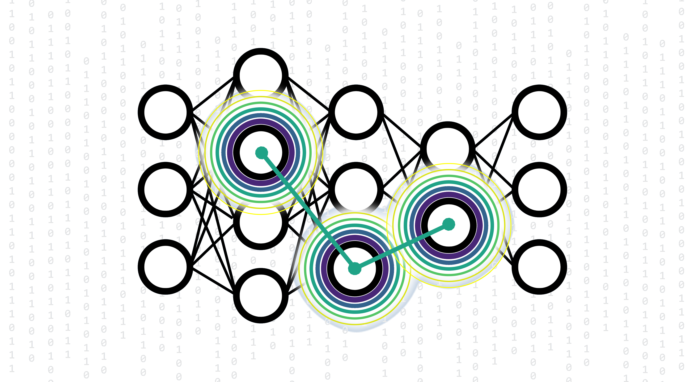

<table align="center">
<tr><td align="center" width="10000">

    

# <strong> X A N E S N E T </strong>

    <a href="https://linkedin.com/in/conorrankine">Dr. Conor D. Rankine </a>
     
    <a href="https://ncl.ac.uk/nes/people/profile/tompenfold.html">Dr. Tom J. Penfold </a>

    <a href="http://penfoldgroup.co.uk">Penfold Group </a> @ <a href="https://ncl.ac.uk">Newcastle University </a>

    <a href="#setup">Setup</a> • <a href="#quickstart">Quickstart</a> • <a href="#publications">Publications</a>

</td></tr></table>

#

Documention for XANESNET REDUX (2025) is a work in progress; watch this space!

## PUBLICATIONS

### The Program:
*[A Deep Neural Network for the Rapid Prediction of X-ray Absorption Spectra](https://doi.org/10.1021/acs.jpca.0c03723)* - C. D. Rankine, M. M. M. Madkhali, and T. J. Penfold, *J. Phys. Chem. A*, 2020, **124**, 4263-4270.

### The Applications:
*[On the Analysis of X-ray Absorption Spectra for Polyoxometallates](https://doi.org/10.1016/j.cplett.2021.138893)* - E. Falbo, C. D. Rankine, and T. J. Penfold, *Chem. Phys. Lett.*, 2021, **780**, 138893.

*[Enhancing the Anaysis of Disorder in X-ray Absorption Spectra: Application of Deep Neural Networks to T-Jump-X-ray Probe Experiments](https://doi.org/10.1039/D0CP06244H)* - M. M. M. Madkhali, C. D. Rankine, and T. J. Penfold, *Phys. Chem. Chem. Phys.*, 2021, **23**, 9259-9269.

### Miscellaneous:
*[The Role of Structural Representation in the Performance of a Deep Neural Network for X-ray Spectroscopy](https://doi.org/10.3390/molecules25112715)* - M. M. M. Madkhali, C. D. Rankine, and T. J. Penfold, *Molecules*, 2020, **25**, 2715.
